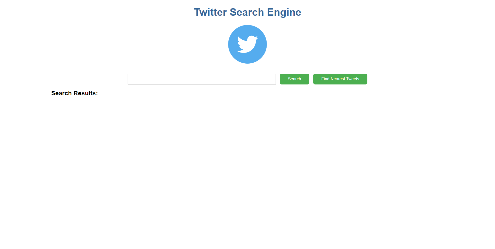
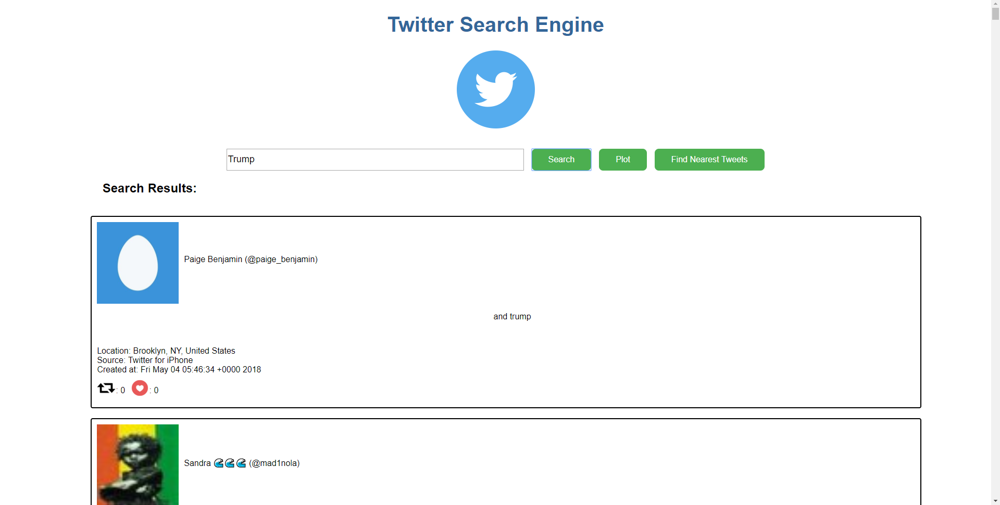
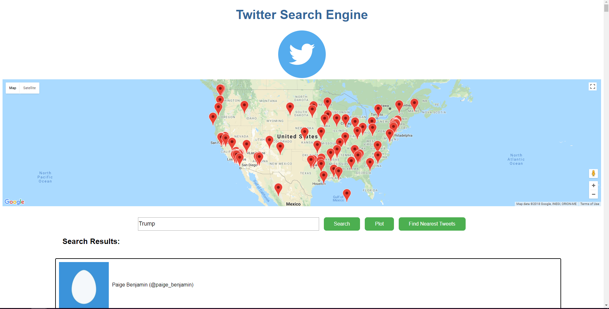
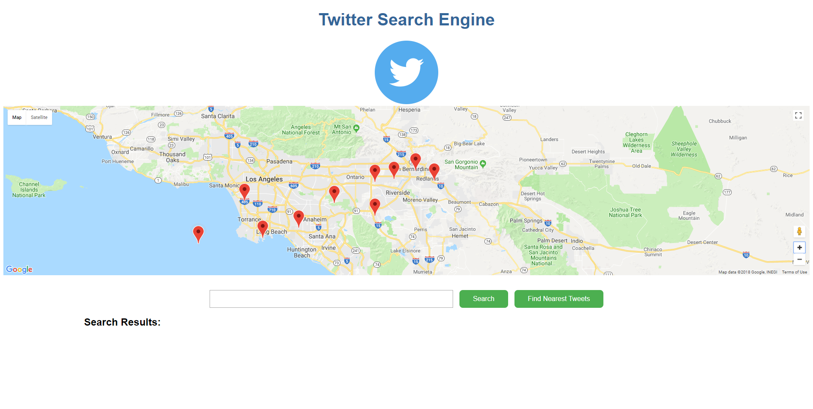

  
<h2> Usage Instructions </h2>  

Open terminal in project directory

Ensure java JDK is installed

npm install -g @angular/cli if not installed

Execute searcher.bat (build index) THEN searcher-front-end.bat (start front end)

<strong>OR</strong>

Navigate to Lucene directory, execute java -jar target/Lucene-0.0.1-SNAPSHOT.jar to create index

Navigate to lucene-searcher/lucene-searcher directory, execute ./mvnw package to create Spring Boot Executable. Then execute java -jar target/lucene-searcher-0.0.1-SNAPSHOT.jar to start Spring Boot process 

Navigate to lucene-searcher/lucene-searcher-front-end and execute ng serve --open to open angular front-end interface and begin searching tweets!
  

<h2>Twitter Search Engine in Action</h2>

This is the web front-end interface for our Twitter Search Engine. There is an input bar that the user enters their query into. They can press search which searches all tweets in the index or they can search the tweets that are nearest to them.

In the image below, we have a query for a keyword “Trump” with the query results displayed below the search bar. For the results, we are showcasing the user’s name, location, the time it was posted, body, likes, and retweets

The image below displays the locations of where the top 100 results were posted. In this example, the query “Trump” can be seen tweeted all across the United States region.

The image below displays the location of the tweets nearest the current location of the user. In this image, the user is located in Riverside, so tweets are around the Los Angeles area.

